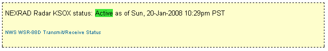
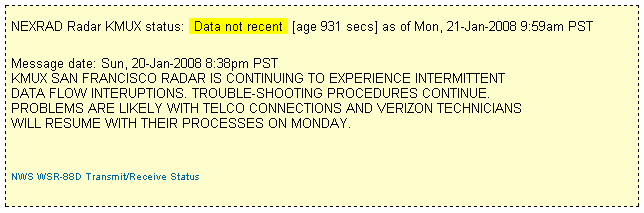
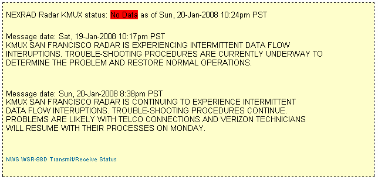

# <a name="NEXRADStatus" id="NEXRADStatus"></a>PHP for current NEXRAD Radar station status display

This script will read (and cache for 60 seconds) the [NWS WSR-88D Transmit/Receive Status](https://weather.noaa.gov/monitor/radar/) page, extract the current status for a selected NEXRAD Station name, and format and display any Free Text messages associated with that station. The default for the script is to not display anything if the selected station is currently 'Green'(Active), and return a message if the station data is 'old' or has 'no data'. I'm using this on my radar page above the GRLevel3 heading to report status on Station KMUX.

Settings:

```php
// settings:  
//  change myRadar to your local NEXRAD radar site ID.
//    other settings are optional
//
  $myRadar = 'KMUX';   // San Francisco
//
  $noMsgIfActive = true; // set to true to suppress message when radar is active
//
  $ourTZ   = 'America/Los_Angeles'; // timezone
  $timeFormat = 'D, d-M-Y g:ia T';
//
// boxStyle is used for <div> surrounding the output of the script .. change styling to suit.
  $boxStyle = 'style="border: dashed 1px black; background-color:#FFFFCC; margin: 5px; padding: 0 5px;"';  
//
  $cacheFileDir = './';   // default cache file directory
  $cacheName = "radar-status.txt";  // used to store the file so we don't have to
//                          fetch it each time
  $refetchSeconds = 60;     // refetch every nnnn seconds
// end of settings</pre>
```
<dl>

<dt>**$myRadar**</dt>

<dd>This is the 4-character NEXRAD Radar station name.  
If used in the Saratoga template, the setting will be replaced by the contents of $SITE['GR3radar'].</dd>

<dt>**$noMsgIfActive**</dt>

<dd>If set = false, then status and messages will be displayed in a box of style $boxStyle.  
If set = true, then status of active will not display, and only 'problem' messages will be displayed in a box of $boxStyle.  
If used in the Saratoga template, the setting will be replaced by the contents of $SITE['showradarstatus']</dd>

<dt>**$ourTZ**</dt>

<dd>Set to your current timezone (PST8PDT, MST7MDT, CST6CDT, EST5EDT or appropriate TZ for your locale)  
If used in the Saratoga template, the setting will be replaced by the contents of $SITE['tz']</dd>

<dt>**$timeFormat**</dt>

<dd>This is the template used to format the dates displayed.  
Default is 'D, d-M-Y g:ia T' which produces dates like 'Mon, 21-Jan-2008 12:29pm PST'  
If used in the Saratoga template, the setting will be replaced by the contents of $SITE['timeFormat']</dd>

<dt>**$boxStyle**</dt>

<dd>This is the style specification for the box surrounding the output of the script. It will not be used if the $noMsgIfActive = true; and the selected NEXRAD station is 'active'.  
Default is 'style="border: dashed 1px black; background-color:#FFFFCC; margin: 5px; padding: 0 5px;"'</dd>

<dt>**$cacheFileDir**</dt>

<dd>This is the relative file path to the directory used to store the $cacheName file.  
The default is './' for the current directory. If used in the Saratoga template, this setting will be replaced by the contents of $SITE['cacheFileDir']</dd>

<dt>**$cacheName**</dt>

<dd>This is the name of the cache file used to store the HTML page from the NWS Radar Status website. Make sure this file is writable by the PHP script.</dd>

<dt>**$refetchSeconds**</dt>

<dd>This specifies the lifetime for the cached page. After this number of seconds, a new page will be fetched and cached.</dd>

</dl>

## Usage

Include the following code in the page where you'd like the output to appear:

```php
<?php include("radar-status.php"); ?>
```

## Samples of the output ( With $noMsgIfActive = false: )


This is displayed if $noMsgIfActive=false; only. It is not displayed otherwise


Displayed if Yellow condition - data is not 'recent'.


Displayed if Red condition - 'No Data'
